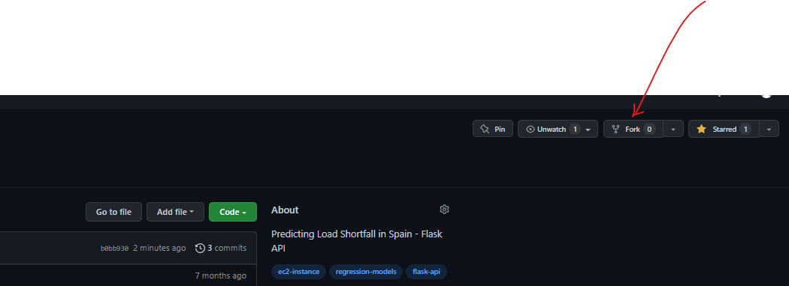

# A FLASK APP BASED REGRESSION PROJECT

#### In Fulfilment of the requirement for the Data Science Professional Certificate at EXPLORE AI.


## 1) Summary of the Project
Spain experiences an energy(load shortfall) crisis, and considers an investment in Renewable energy.

For this investment to be worth it the government needs to be able to predict load shortfall as a function of time, and other demographic/climatic features in order to direct asset deployment to renewable energy generation.

This repository shows how spain energy shortfall data(historical) can be used to accurately predict load shortfall in the future.

For this repository, please refer to the following files:

| File Name              | Description                                                                       |
| :--------------------- | :---------------------------------------------------------------------------------|
| APP Files              |                                                                                   |
| `api.py`               | Flask web server application definition and instantiation.                        |
| `model.py`             | Contains helper functions to separate model specific code from our API definition.|
| utils                  | Simple script to simulate a POST request sent to our API.                         |
| `utils/request.py`     | Simple script to simulate a POST request sent to our API.                         | 
| `utils/train_model.py` | Used to train the simple model used for demonstration of the API's functioning.   |
| `Notebook.ipynb`       | Documentation for model development.                                              |

## 2) Project Workflow
The project spanned a period of one month, with each phase execution as below:
 - Exploratory Data Analysis & Domain Knowledge -> Week 1
 - More DOmain Knowledge & Data Engineering (Creation of time features, dropping multicollinear features) -> Week 2
 - Build Multiple Regressors, Model Selection & Hyperparameter Tuning -> Week 3
 - Re-configure the base ```Flask app``` with the newly built model -> Week 3
 - Complete the Github repository, Clone to an AWS EC2 instance using SSH connection -> Week 4
 - Run the Flask App on the local mchine and deploy to the cloud ✈ ☁ -> Week 4
 
## 2) How to Use this Repo/App

#### 2.1) Creating a copy of this repo

| ⚡️ WARNING ⚡️ |
|:--------------------|
|Do **NOT** *clone* this repository. Instead follow the instructions in this section to *fork* the repo.|

  

To fork the repo, simply ensure that you are logged into your GitHub account, and then click on the 'fork' button at the top of this page as indicated within the figure above.

#### 2.2) Running the API on your local machine

As a first step to becoming familiar with our API's functioning, we recommend setting up a running instance on your own local machine.

To do this, follow the steps below by running the given commands within a Git bash (Windows), or terminal (Mac/Linux):

 1. Ensure that you have the prerequisite Python libraries installed on your local machine:

 ```bash
 pip install -U flask numpy pandas scikit-learn
 ```

 2. Clone the *forked* repo to your local machine.

 ```bash
 git clone https://github.com/{your-account-name}/Helping-Spain-Load-Shortfall-Challenge-api.git
 ```  

 3. Navigate to the base of the cloned repo, and run the API web-server initialisation script.


 ```bash
 cd Helping-Spain-Load-Shortfall-Challenge-api/
 python api.py
 ```

 If the web server was able to initialise successfully, the following message should be displayed within your bash/terminal session:

```
----------------------------------------
Model successfully loaded
----------------------------------------
 * Serving Flask app "api" (lazy loading)
 * Environment: production
   WARNING: This is a development server. Do not use it in a production deployment.
   Use a production WSGI server instead.
 * Debug mode: off
 * Running on http://0.0.0.0:5000/ (Press CTRL+C to quit)
```

4. Leave the web server script running within the current bash/terminal session. Open a new session, and navigate to the `utils` subfolder of the cloned repo.

```
cd {your/custom/path}/load-shortfall-regression-predict-api/utils/
```

5. Run the `request.py` script located within the utils subfolder to simulate a POST request for our running API.

```
python request.py
```


If you receive an error at this point, please ensure that the web server is still running in your original bash/terminal session. If the script ran successfully, you should receive similar output to the message shown below:


```
Sending POST request to web server API at: http://127.0.0.1:5000/api_v0.1

Querying API with the following data: 
 [8764, '2018-01-01 03:00:00', 4.6666666667, 'level_8', 0.0, 5.3333333333, 89.0, 78.0, 0.0, 3.6666666667000003, 0.0, 143.3333333333, 4.6666666667, 266.6666666667, 0.0, 0.6666666667, 0.0, 'sp25', 0.0, 0, 1020.3333333333001, 0.0, 0.0, 0.0, 0, 800.0, 800.3333333333001, 1026.6666666667, 800.0, nan, 282.48333333330004, 1030.3333333333, 284.15, 284.15, 721.0, 281.67333333330004, 53.6666666667, 284.15, 284.8166666667, 280.48333333330004, 284.19, 277.8166666667, 281.01, 283.48333333330004, 284.15, 281.15, 279.1933333333, 278.15]

Received POST response:
**************************************************
API prediction result: 9518.37493239743
The response took: 0.010888 seconds
**************************************************
```

Your recommendations are welcome.
